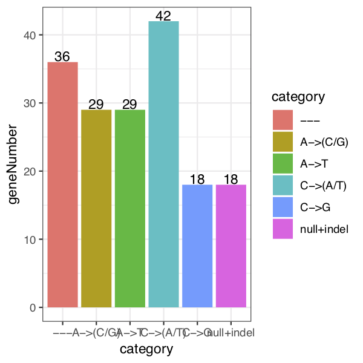
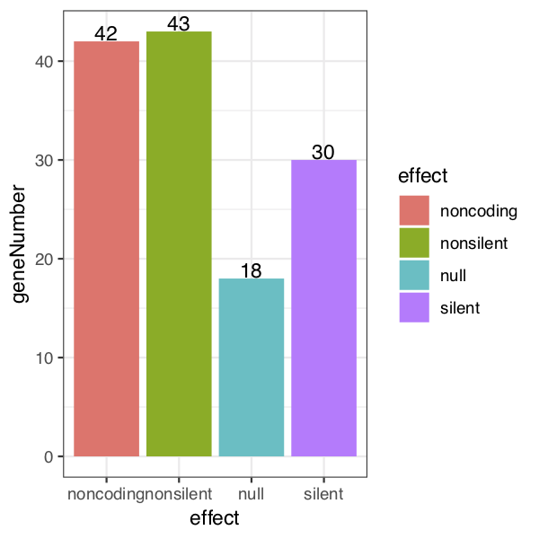
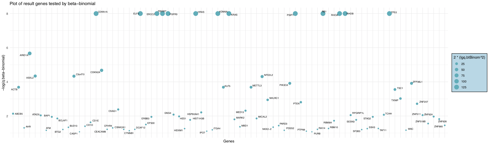
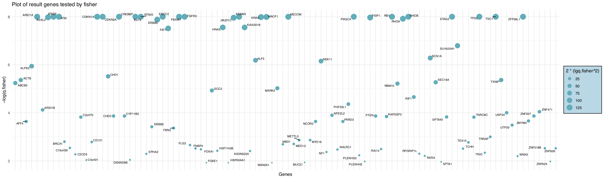
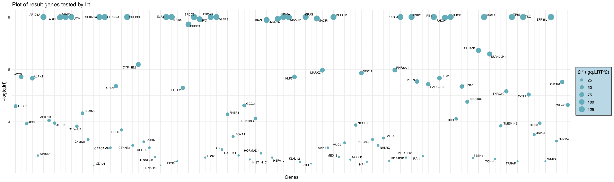
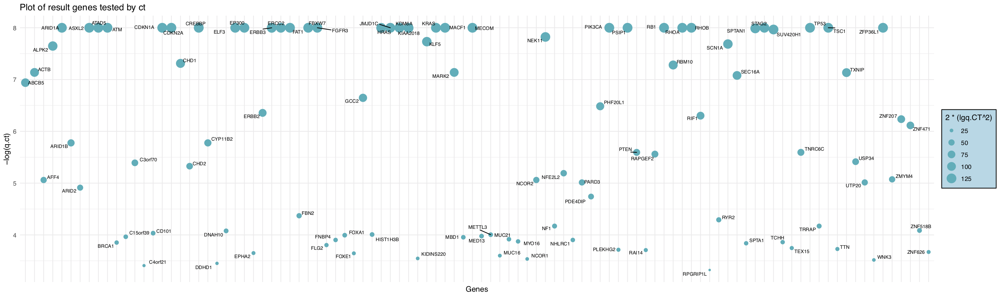
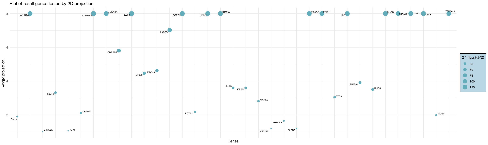
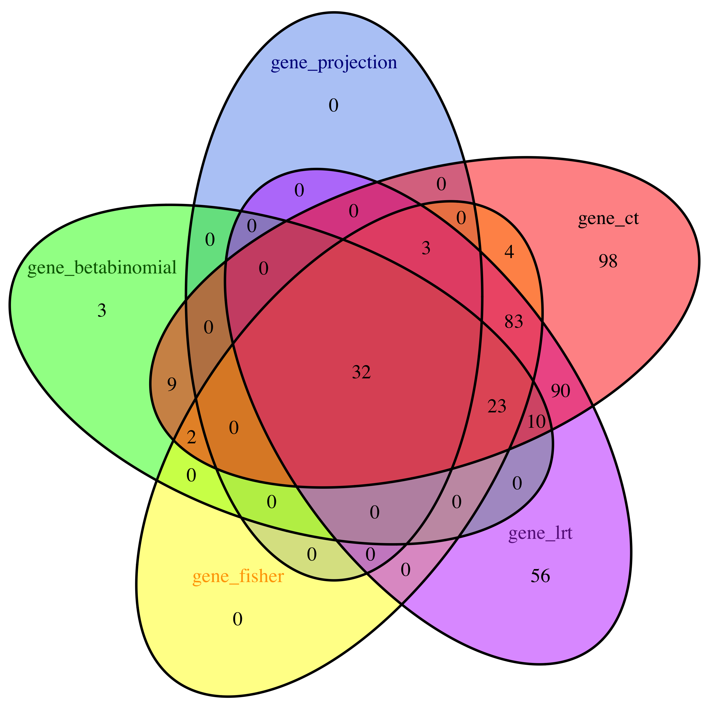

# Getting started

__Installing the package.__ To install the _DriverGenePathway_ package, the easiest way is through bioconductor:

```{r, eval=FALSE}
if (!requireNamespace("BiocManager", quietly=TRUE))
    install.packages("BiocManager")
BiocManager::install(DriverGenePathway)
```

Other ways to install DriverGenePathway is to first download the appropriate file for 
your platform from the Bioconductor website [http://www.bioconductor.org/](http://www.bioconductor.org/). 
For Windows, start R and select the `Packages` menu, then `Install package from local zip file`.
Find and highlight the location of the zip file and click on `open`. For Linux/Unix, use the usual command 
`R CMD INSTALL` or install from bioconductor.

__Loading the package.__ To load the `DriverGenePathway` package in your R session, type
`library(DriverGenePathway)`.

__Help files.__  Detailed information on `DriverGenePathway` package 
functions can be obtained in the help files. For example, to view the help file 
for the function `DriverGenePathway` in a R session, use `?DriverGenePathway`.

# Introduction

The main purpose of DriverGenePathway is to identify significantly important mutated genes and gene sets (pathways) that are responsible for cancer, called driver genes and driver pathways, thus this package contains two main functions, `DriverGenes` and `DriverPathway`, aimming respectively at searching driver genes and driver pathways. For `DriverGenes`, we provided 5 methods of hypothesis test. The process mainly consists of three sections. First the mutation and coverage data are preprocessed after guaranteed available. Then with covariate data, the background mutation rate for each gene is calculated. Finally the significant genes are discovered via hypothesis test methods. Regarding `DriverPathway`, a de novo method is employed to search the driver pathway. It models an optimal submatrix function based on coverage and mutual exclusivity, which are basic characteristics of driver pathways. In addition, the submatrix optimization problem (a quadratic programming problem) is solved by genetic algorithm. 

# `DriverGenes`

## Importing data

To run `DriverGenes`, 3 input data sets and a directory of chromosome files are required. The first data set is mutation MAF(Mutation Annotation Format) of a paticular cancer type, containing information of mutations. The second is coverage data, containing information of coverages. The third data set is covariate data, which contains values of covariates, and is used for background mutation rate discovery. In addition, the chromosome files directory can be either hg19 or hg38, and the hg19 directory is available at [http://www.bioconductor.org/](http://www.bioconductor.org/).Each of these 3 data sets are matrix objects. As example, small data sets are available in the DriverGenePathway package.

```{r}
library(DriverGenePathway)
data(SampleMutationMaf)
data(SampleCoverage)
data(SampleCovariate)

head(M)
head(C)
head(V)

```


## Preprocessing

First of all, the availability of input data should be guaranteed. Items in MAF such as "gene","patient","mutation effect" and "mutation category" are preprocessed. Then mutation categories are assigned for each mutation. The covariate data which may include "NA" are preprocessed by filling the missing values through clustering. 

## Calculating background mutation rate

After preprocessing, the output data including mutation, coverage and covariate data are used to calculate background mutation rate. The parameter bmr, which represent the default background mutation rate is set 1.2e-06 initialy, could be modified. This process outputs a list of matrix which is a intermediate result, will then be used in varified specific gene detecting methods.

## Detecting driver genes

Here we present a variate of methods of hypothesis test to detect driver genes, i.e. Beta Binomial test, Fisher combined P-value test, Likelihood Tatio test, Convolution test and 2D-projection method. The default mode is `allTest`, which runs all above hypothesis tests.


The function outputs txt files of result significant genes.

## Usage of `DriverGenes`

Here is a sample of the usage of `DriverGenes`. Note that the function relies on the chromosome file directory, which is too big to be integrated in the package. Make sure to set the workspace with the above mentioned folder. For meanings and usages of parameters, see help documentation.

```{}
DriverGenes(Mutation = M, Coverage = C , Covariate = V, chr_files_directory =  "hg19",categ_flag = NaN, bmr = 1.2e-6, p_class = "allTest", sigThreshold = 0.1)
```

## Results and outputs

The output of `DriverGenes` includes preprocessed results and significant genes, saved in two folders automaticaly. The preprocessed result consists of a txt file of mutation categories as well as 2 pdf plots, showing the number of genes of each category and each effect. We take BLCA data as an example to show the results.

```{r echo=FALSE, fig.align='center', fig.pos="w", out.width="70%"}


```

The result of significant genes includes top genes with their p-values and q-values saved as csv file. A table of all q_values is also generated.

```{r}
data(BB)
data(FCPT)
data(LRT)
data(CT)
data(PJ)
data(q_values)

head(BB)
head(FCPT)
head(LRT)
head(CT)
head(PJ)
head(q_values)

```

A corresponding plot showing gene significance by q-values is saved as pdf file, named after the hypothesis test method adopted. If `p_class` is set "allTest", a venn plot showing the number of common genes is also generated.

```{r echo=FALSE}





```

```{r echo=TRUE, fig.align='center', fig.pos="w", out.width="70%"}

```

# `DriverPathway`

## Importing data
The input data is a mutation matrix for which a sample is shown below. 

```{r}
library(DriverGenePathway)
data(SampleMutationMatrix)
head.matrix(mutation_matrix)
```

## De novo method for discovering driver pathway
The DriverGenePathway package also provides a de novo method based on mutual exclusivity and coverage to search driver pathway. The input of function "de_novo_driver_pathway" includes a mutation matrix for which a sample is shown below. 

```{}
data(SampleMutationMatrix)
head(mutation_matrix)
```
The "de_novo_driver_pathway" uses the Genetic algorithm as optimization method, for which some parameters are supposed to be set. The parameters have default values, see the help documentation. In order to reach the optimum result, it is suggested that the parameters be set manually. Underneath goes a sample of this function, which outputs a list.

## Usage of `DriverPathway`

```{}
denovoOut <- de_novo_driver_pathway(mutation_matrix,
  driver_size=3, pop_size=30, iters=100, permut_time=50)
```

## Results and outputs
